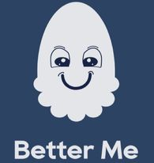

# BetterMe - Android Task Management and Mood Tracking App 

The Major Project Android App is a task management and mood tracking application developed as part of a major project. It allows users to create and manage their to-do lists, rate their daily mood, and collaborate with supervisors for scheduling activities and receiving feedback. The app is built using the modern Jetpack Compose framework for a sleek and intuitive user interface. Data is stored online using Cloud Firestore, and user authentication is handled by Firebase Authentication service. The app planning process was organized using Trello, and the app's design was prototyped using Figma.

## Features

- **Task Management**: Users can create, view, and manage their to-do lists, keeping track of tasks and their completion status. Tasks can be easily deleted by dragging them to the left of the screen.

- **Mood Tracking**: Users can rate their daily mood, allowing them to reflect on their emotional well-being over time.

- **Supervisor Collaboration**: Users can add supervisors who have access to their calendar, enabling supervisors to schedule activities and provide feedback on a daily basis.

## Technical Stack

The Major Project Android App leverages the following technologies:

- **Jetpack Compose**: The app's user interface is built using Jetpack Compose, a modern UI toolkit for building native Android apps.

- **Cloud Firestore**: Data storage and synchronization are managed using Cloud Firestore, allowing users to access their data across devices.

- **Firebase Authentication**: User authentication and security are handled by Firebase Authentication service, providing a seamless and secure login experience.

- **Trello**: The app planning process was organized using Trello, a collaboration tool that helps manage tasks and workflows.

- **Figma**: The app's design was prototyped using Figma, a web-based design and prototyping tool that allows for collaborative design exploration.
